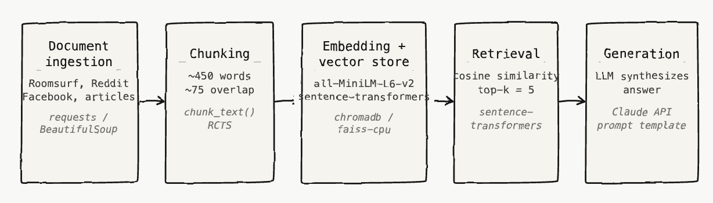

# Project 1 Planning: The Unofficial Guide

> Write this document before you write any pipeline code.
> Your spec and architecture diagram are what you'll use to direct AI tools (Claude, Copilot, etc.) to generate your implementation — the more specific they are, the more useful the generated code will be.
> Update the Retrieval Approach and Chunking Strategy sections if you change your approach during implementation.
> Update this file before starting any stretch features.

---

## Domain

<!-- What domain did you choose? Why is this knowledge valuable and hard to find through official channels? -->
I decided to choose roommate/community matching as my domain because I'm personally interested in the intersection of AI and interpersonal relationships. I believe AI can be used to help connect people of similar backgrounds and interests together. Also, unless you're extroverted or outgoing it's usually hard to find people from similar backgrounds. Introverts who reside at home for most of the day or haven't found communities to regularly be apart of stuggle find connections. There are general roomate matching services available at each university but these services usually don't go in depth as they have thousands of university students to serve. Also, the limited amount of official channels that are actually available online still require work to search and read through this profile. In an age federally declared at the "loneliness epidemic" (especially for young adults ofs age 18-24) this project seeks to mitigate those issues and use technology to connect people together rather than bring them further apart.

---

## Documents

<!-- List your specific sources: URLs, subreddit names, forum threads, or file descriptions.
     Aim for at least 10 sources that together cover different subtopics or perspectives within your domain. -->

| # | Source | Type | URL or file path |
|---|--------|------|-----------------|
| 1 | NC State CSC student organizations|University department web page (HTML) | https://csc.ncsu.edu/academics/student-organizations/|
| 2 |NC State MAE student organizations | University department web page (HTML)| https://mae.ncsu.edu/student-organizations/|
| 3 |NC State CCEE student organizations |University department web page (HTML) | https://ccee.ncsu.edu/student-organizations/|
| 4 | NC State ISE student organizations|University department web page (HTML) |https://ise.ncsu.edu/current-students/student-organizations/ |
| 5 | NC State BAE student organizations|University department web page (HTML) | https://bae.ncsu.edu/academics/student-organizations/|
| 6 |Nature Human Behaviour, neural similarity and friendship |Peer-reviewed journal article |https://www.nature.com/articles/s41562-025-02266-7 |
| 7 |Frontiers in Psychology, personality homophily and group success | Peer-reviewed journal article| https://www.frontiersin.org/journals/psychology/articles/10.3389/fpsyg.2020.00710/full|
| 8 | Simply Psychology, the science of adult friendships| Popular-science article| https://www.simplypsychology.com/articles/adult-friendships-research|
| 9 | APA Monitor, the science of friendship|Professional-association article | https://www.apa.org/monitor/2023/06/cover-story-science-friendship|
| 10 | Roomsurf, NC State roommate profiles|Roommate-matching site (user profiles) | https://www.roomsurf.com/north-carolina-state-university-roommates/|

Others:
- https://csc.ncsu.edu/academics/student-organizations/
- https://mae.ncsu.edu/student-organizations/
- https://ccee.ncsu.edu/student-organizations/
- https://ise.ncsu.edu/current-students/student-organizations/
- https://bae.ncsu.edu/academics/student-organizations/
- https://orgs.ncsu.edu/find-a-site/

---

## Chunking Strategy

<!-- How will you split documents into chunks?
     State your chunk size (in tokens or characters), overlap size, and explain why those
     numbers fit the structure of your documents.
     A review-heavy corpus warrants different chunking than a long FAQ. -->

**Chunk size:**
~ 450 words 

**Overlap:**
~ 75 words

**Reasoning:**
My documents vary in size, documents coming from the roomate site for example are short in size with only a few words describing each person. Other sources like roomate posts from facebook are usually paragraph length while documents coming from research backed sources are several paragraphs long. This makes the chunk size need to be something that is adaptable. For example a fixed chunk size strategy would've worked for the first source mentioned (the roomate website), but this same strategy wouldn't work well for the research-backed documents. For this reason, I've decided to go with medium-sized chunks that account for ~ 450 words for my chunk size. If a key fact expands two adjacent chunks, I'll fall back on an overlap of about ~75 words to attempt to connect the two ideas together. This will leave longer documents with about one paragraph of overlap to be able to synchronize.

---

## Retrieval Approach

<!-- Which embedding model are you using (e.g., all-MiniLM-L6-v2 via sentence-transformers)?
     How many chunks will you retrieve per query (top-k)?
     If you were deploying this for real users and cost wasn't a constraint, what tradeoffs
     would you weigh in choosing a different embedding model — context length, multilingual
     support, accuracy on domain-specific text, latency? -->

**Embedding model:**
all-MiniLM-L6-v2 via sentence-transformers

**Top-k:**
I'll retrieve the top 5 chunks for each query. Roommate searching demands a count that is high ~5 chunks to give more options but we also don't want to overwhelm each query with information (especially for queries that are focused on the research/backing behind which connections would be best, these don't need over 5 chunks).

**Production tradeoff reflection:**
If this were deploying to real users I would compare embedding models to see which one offers the best result. I think accuracy is most important for a project like this because the goal is to connect users with people they would actually get along with, so retrieving the most relevant information matters more than having a fast or cheap model. I would also consider how well the model understands student the content we're giving it (especially the content that is coming from social media sites such as Reddit or Facebook).

---

## Evaluation Plan

<!-- List your 5 test questions with their expected correct answers.
     Questions should be specific enough that you can judge whether the system's response
     is right or wrong. "What are good dining halls?" is too vague.
     "What do students say about wait times at [dining hall name] during lunch?" is testable. -->

| # | Question | Expected answer |
|---|----------|-----------------|
| 1 | I’m interested in agricultural robotics. What club could help me meet people with that interest? | RoboPack because it builds autonomous robots for agricultural tasks. |
| 2 | Why would it be harder for a night owl and an early riser to become friends?| There may not be many opportunities for the two to interact because their schedules don't |
| 3 | Are there any engineering students currently looking for roommates? | Yes multiple roommate listings include students majoring in engineering.|
| 4 | Do roommates with similar personalities bond better than those with different ones? | Yes. Research on personality homophily found that similarity in traits like conscientiousness and neuroticism predicted group formation, and that greater personality differences were associated with weaker group bonding. |
| 5 | My potential roommate and I clicked right away, does that mean we'll actually get along long-term? | Not necessarily. Research suggests lasting friendships are rooted in deeper pre-existing similarities rather than an initial spark and that maintaining a relationship long-term takes ongoing effort. |

---

## Anticipated Challenges

<!-- What could go wrong? Name at least two specific risks with reasoning.
     Consider: noisy or inconsistent documents, missing source attribution, off-topic
     retrieval, chunks that split key information across boundaries. -->

1. I think the quality of the responses might be bad, if social media post sources aren't good quality. Social media posts (like ones from Reddit) include include slang, jokes, complaints, or outdated opinions, which could make retrieval bad.

2. There's also a high chance for missing-source attribution or off-topic retrieval. A query about finding quiet study buddies might retrieve general club pages that mention studying but do not actually describe social compatibility.

---

## Architecture

<!-- Draw a diagram of your pipeline showing the five stages:
     Document Ingestion → Chunking → Embedding + Vector Store → Retrieval → Generation
     Label each stage with the tool or library you're using.
     You can use ASCII art, a Mermaid diagram, or embed a sketch as an image.
     You'll use this diagram as context when prompting AI tools to implement each stage. -->

---

## AI Tool Plan

<!-- For each part of the pipeline below, describe:
     - Which AI tool you plan to use (Claude, Copilot, ChatGPT, etc.)
     - What you'll give it as input (which sections of this planning.md, which requirements)
     - What you expect it to produce
     - How you'll verify the output matches your spec

     "I'll use AI to help me code" is not a plan.
     "I'll give Claude my Chunking Strategy section and ask it to implement chunk_text()
     with my specified chunk size and overlap" is a plan. -->

**Milestone 3 — Ingestion and chunking:**
I'll use Claude to help implement the chunk_text() function. I will provide my chosen chunk size of ~ 450 words (with an overlap of ~75 words), and ask it to generate code that splits documents while preserving overlap.

**Milestone 4 — Embedding and retrieval:**
I'll give Claude my chosen embedding model (all-MiniLM-L6-v2) and ask it to help write code that converts chunks into embeddings, stores them with source metadata, and retrieves the top 5 most relevant chunks for a given user query.

**Milestone 5 — Generation and interface:**
I'll also use Claude to debug retrieval results. E.g: if a query returns irrelevant chunks, I can paste the query, retrieved chunks, and expected answer into Claude and ask whether the problem is chunk size, source quality, or the retrieval strategy.